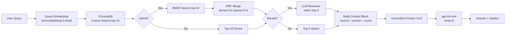

# Architecture — RAG Pipeline (Day 08 Lab)

> Template: Điền vào các mục này khi hoàn thành từng sprint.
> Deliverable của Documentation Owner.

## 1. Tổng quan kiến trúc

```
[Raw Docs]
    ↓
[index.py: Preprocess → Chunk → Embed → Store]
    ↓
[ChromaDB Vector Store]
    ↓
[rag_answer.py: Query → Retrieve → Rerank → Generate]
    ↓
[Grounded Answer + Citation]
```

**Mô tả ngắn gọn:**
Hệ thống trợ lý nội bộ cho khối CS và IT Helpdesk, cho phép nhân viên tra cứu chính sách (hoàn tiền, SLA, cấp quyền, HR) bằng ngôn ngữ tự nhiên. Pipeline RAG index 5 tài liệu nội bộ vào ChromaDB, retrieve theo embedding similarity, và sinh câu trả lời grounded có citation từ LLM.

---

## 2. Indexing Pipeline (Sprint 1)

### Tài liệu được index
| File | Nguồn | Department | Số chunk |
|------|-------|-----------|---------|
| `policy_refund_v4.txt` | policy/refund-v4.pdf | CS | 6 |
| `sla_p1_2026.txt` | support/sla-p1-2026.pdf | IT | 5 |
| `access_control_sop.txt` | it/access-control-sop.md | IT Security | 7 |
| `it_helpdesk_faq.txt` | support/helpdesk-faq.md | IT | 6 |
| `hr_leave_policy.txt` | hr/leave-policy-2026.pdf | HR | 5 |
| **Tổng** | | | **29** |

### Quyết định chunking
| Tham số | Giá trị | Lý do |
|---------|---------|-------|
| Chunk size | 400 tokens (~1600 ký tự) | Đủ ngữ cảnh cho 1 điều khoản, không quá dài cho prompt |
| Overlap | 80 tokens (~320 ký tự) | Tránh mất ngữ cảnh tại ranh giới chunk |
| Chunking strategy | Heading-based (`=== ... ===`) → paragraph fallback | Ưu tiên ranh giới tự nhiên của tài liệu |
| Metadata fields | source, section, effective_date, department, access | Phục vụ filter, freshness, citation |

### Embedding model
- **Model**: OpenAI `text-embedding-3-small`
- **Vector store**: ChromaDB (PersistentClient, local persistent)
- **Similarity metric**: Cosine

---

## 3. Retrieval Pipeline (Sprint 2 + 3)

### Baseline (Sprint 2)
| Tham số | Giá trị |
|---------|---------|
| Strategy | Dense (embedding similarity) |
| Top-k search | 10 |
| Top-k select | 3 |
| Rerank | Không |

### Variant 1 (Sprint 3)
| Tham số | Giá trị | Thay đổi so với baseline |
|---------|---------|------------------------|
| Strategy | Hybrid (Dense + BM25, RRF k=60) | ✅ Thay đổi |
| Dense weight | 0.6 | mới |
| Sparse weight | 0.4 | mới |
| Top-k search | 10 | không đổi |
| Top-k select | 3 | không đổi |
| Rerank | Không | không đổi |
| Query transform | Không | không đổi |

**Lý do chọn variant này:**
Corpus có cả văn bản tự nhiên lẫn tên riêng/mã chuyên ngành (P1, Level 3, ERR-403, Approval Matrix). Giả thuyết BM25 sẽ cải thiện recall cho alias query (q07) và error code query (q09). Kết quả: giả thuyết sai — context recall đã đạt 5.00 ở baseline, hybrid không thêm giá trị và gây noise ở q06, q09.

---

## 4. Generation (Sprint 2)

### Grounded Prompt Template
```
Answer only from the retrieved context below.
If the context is insufficient, say you do not know.
Cite the source field when possible.
Keep your answer short, clear, and factual.

Question: {query}

Context:
[1] {source} | {section} | score={score}
{chunk_text}

[2] ...

Answer:
```

### LLM Configuration
| Tham số | Giá trị |
|---------|---------|
| Model | `gpt-4o-mini` |
| Temperature | 0 (output ổn định cho eval) |
| Max tokens | 512 |

---

## 5. Failure Mode Checklist

> Dùng khi debug — kiểm tra lần lượt: index → retrieval → generation

| Failure Mode | Triệu chứng | Cách kiểm tra |
|-------------|-------------|---------------|
| Index lỗi | Retrieve về docs cũ / sai version | `inspect_metadata_coverage()` trong index.py |
| Chunking tệ | Chunk cắt giữa điều khoản | `list_chunks()` và đọc text preview |
| Retrieval lỗi | Không tìm được expected source | `score_context_recall()` trong eval.py |
| Generation lỗi | Answer không grounded / bịa | `score_faithfulness()` trong eval.py |
| Token overload | Context quá dài → lost in the middle | Kiểm tra độ dài context_block |

---

## 6. Diagram


