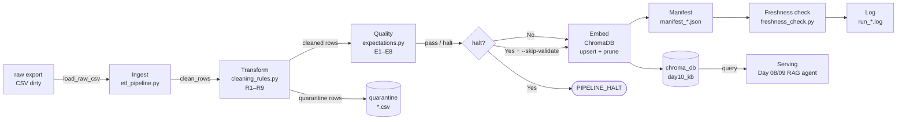

# Kiến trúc pipeline — Lab Day 10

**Nhóm:** Nhóm 29 — E403  
**Thành viên:** Hàn Quang Hiếu, Nguyễn Bình Thành  
**Cập nhật:** 2026-04-15

---

## 1. Sơ đồ luồng

**Điểm đo freshness:** trường `latest_exported_at` trong manifest — lấy từ max `exported_at` của cleaned rows.  
**run_id:** ghi ở dòng đầu log và trong manifest JSON.  
**Quarantine:** mỗi row bị loại ghi kèm `reason` vào `artifacts/quarantine/quarantine_<run-id>.csv`.

---

## 2. Ranh giới trách nhiệm

| Thành phần | Input | Output | Owner nhóm |
|------------|-------|--------|------------|
| Ingest | `data/raw/policy_export_dirty.csv` | list of raw dicts | Hàn Quang Hiếu |
| Transform | raw dicts | cleaned dicts + quarantine dicts | Hàn Quang Hiếu |
| Quality | cleaned dicts | ExpectationResult list + halt flag | Nguyễn Bình Thành |
| Embed | cleaned CSV + run_id | ChromaDB upsert, prune log | Nguyễn Bình Thành |
| Monitor | manifest JSON | PASS/WARN/FAIL + detail dict | Nguyễn Bình Thành |

---

## 3. Idempotency & rerun

Pipeline dùng chiến lược **upsert theo `chunk_id`**:

- `chunk_id` được tính bằng `SHA-256(doc_id | chunk_text | seq)[:16]` — ổn định nếu nội dung không đổi.
- Trước mỗi lần upsert, pipeline lấy toàn bộ id hiện có trong collection, tính `drop = prev_ids - new_ids`, rồi gọi `col.delete(ids=drop)` để xóa vector lạc hậu (log: `embed_prune_removed`).
- Rerun 2 lần với cùng cleaned CSV → upsert ghi đè, không phình collection; `embed_prune_removed=0` lần 2.
- Kết quả: index luôn là **snapshot chính xác** của cleaned run gần nhất — không còn vector cũ làm nhiễu retrieval.

---

## 4. Liên hệ Day 09

- Cùng corpus 5 tài liệu (`data/docs/`) với Day 09, nhưng Day 10 dùng **collection riêng** `day10_kb` (thay vì `day09_kb`) để tránh ảnh hưởng kết quả Day 09.
- Pipeline Day 10 đóng vai trò **tầng ingest/clean** phía trước: nếu tích hợp thật, agent Day 09 sẽ query `day10_kb` thay vì index thủ công.
- Bằng chứng: `eval_after_clean.csv` dùng cùng câu hỏi golden với Day 09 (`q_refund_window`, `q_leave_version`) và cho kết quả `contains_expected=yes`, `hits_forbidden=no` sau khi pipeline clean đúng.

---

## 5. Rủi ro đã biết

- `freshness_check=FAIL` là bình thường với data snapshot cũ (`exported_at=2026-04-10`) — SLA 24h áp cho pipeline run, không phải cho snapshot tĩnh trong lab.
- `chunk_id` thay đổi nếu `chunk_text` thay đổi (ví dụ R7 strip tag) → vector cũ bị prune, cần rerun eval sau mỗi lần thay đổi rule.
- Allowlist `ALLOWED_DOC_IDS` hard-code trong `cleaning_rules.py` — cần đồng bộ với `data_contract.yaml` khi thêm doc mới.
